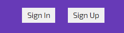
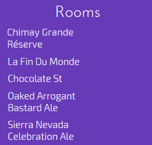
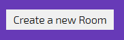
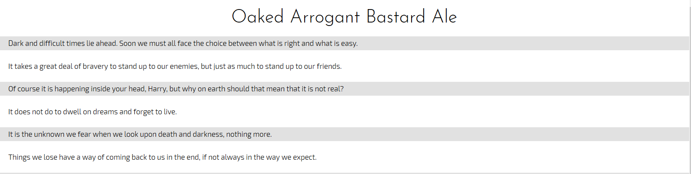
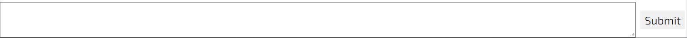

# Vue-Chat

When I want to get started using a new front end framework, I like to create another implementation of a project that I completed a long time ago. That particular project is just a Slack-like clone of a chatting service, with the ability to create rooms and messages as well as log into the service. I find its slightly more involved than your basic "Todo App" structure and really lets me get my feet wet with some of the more advanced features of an application, which I really like. It has helped me learn at least 4 frameworks so far (AngularJS, Angular, React, and Vue), and help me decide what I feel are the strength and weaknesses of each and where I think its most appropriate to use each framework in the grand scheme of web development of today

Vue-Chat added a new element to my traditional chatting services (which can be found on my github page under "chatty" if you would like to look at those as well), in that instead of using Firebase to implement a Backend as a Service, I built a Rails API that I could use to interact with any frontend, ambiguous of which technology is used. Future implementations will likely hinge on this versions server implementation and they will get messages and users using the same backend http requests. This kind of architecture where the backend interacts with the frontend through an API is powerful, and I think it makes scaling applications or modifying technologies simpler.

## Back End
---
The Backend for this application was created using Ruby on Rails in API mode. 

### Ruby on Rails Versioning

This project uses...

- Ruby 2.4.3
- Rails 5.1.5

### Dependencies

In addition to the common Rails Dependencies this project uses the following gems to provide additional features

- rack-cors: provide future CORS support
- fast_jsonapi: Data seriaization using Netflix's gem
- devise_token_auth:  token authorization appropriate for an api
- faker: create fake data to display on development and production server

### Running Locally

To install the backend, you will need to be running a postgresql server and provide the details for local database creation. After your pg server is up and running, bundle and install dependencies, and setup and migrate the database

```bash
bundle install
rails db:setup
```
To serve locally, you can a rails server
```bash
rails s
```
the frontend will proxy the api at `http://localhost:3000` in development, so make sure that you run it on the default port or change the proxy location in the vue client of the application. In production the application runs both servers on the same host and doesn't need to proxy requests.

After the server is up and running you should be able to visit `https://localhost:3000` and see the default rails page to ensure that the app is running. You can visit one of the routes to see the json response of the system

### API Usage

There are 3 basic API functionality

- Room CRUD
- Message CRUD
- Devise routes (which include creating users and sessions)

all routes start with the base of `/api` to make it clear you are interacting with an api and not a static page renderer
#### Room API

The routing for rooms follows the typical structure found in Rails applications for routing CRUD. In these routes `:id` represents the database id of the room you are trying to query.

| Route | Action Type | Controller Action |
| --- | --- | --- |
| `/rooms` | GET | rooms#index |
| `/rooms` | POST | rooms#create |
| `/rooms/:id` | GET | rooms#show |
| `/rooms/:id` | PATCH or PUT | rooms#update |
| `/rooms/:id` | DELETE | rooms#destroy |


#### Messages API

Messages are a nested route inside of room, and as such all messages calls must be nested inside of a `/rooms/:id` route to provide the room id to the database along with the messages route. For example, the full route to GET `/messages` for room id 1 would be `http://localhost:3000/api/room/1/messages`

| Route | Action Type | Controller Action |
| --- | --- | --- |
| `/messages` | GET | messages#index |
| `/messages` | POST | messages#create |
| `/messages/:id` | GET | messages#show |
| `/messages/:id` | PATCH or PUT | messages#update |
| `/messages/:id` | DELETE | messages#destroy |

#### Authorization API

The route for authorization follows the structure of a call to `/api/auth`. Because the back end uses [devise_token_auth](https://github.com/lynndylanhurley/devise_token_auth) to implement authorization, you should read their excellent [documentation](https://github.com/lynndylanhurley/devise_token_auth#usage-tldr) about the default routes that are implemented for this project. No special configuration was added to change the provided routes provided by devise_token_auth. Oauth is not currently implemented, so do not used any of the `:provider` routes specifed by devise_token_auth.

#### Serialized Response

The system when queried correctly will respond with a JSON object serialized using the [fast_jsonapi](https://github.com/Netflix/fast_jsonapi) developed by Netflix. The following information in included in the serialized response in addition to the defaults like `id` and `type`

##### Rooms

- Attributes: `name`
- Relationship: `has_many :messages`

##### Messages

- Attributes: `content`
- Relationships: `belongs_to :room`

## Frontend
---
The Front End of the application was built using [vue-cli](https://github.com/vuejs/vue-cli) an amazing tool for scaffolding out Vue Single Page Applications. 

### Additional Dependencies

Vue includes a lot of power right out the box, and it has additional solutions for problems like state management and routing created by the Vue team to interact beautifully with the rest of the Vue framework. This project uses

- [Vuex](https://github.com/vuejs/vuex) for state management
- [Vue-Router](https://router.vuejs.org/en/) for client side routing
- [axios](https://github.com/axios/axios) for http requests to the backend

### Running Locally

First and foremost, anything to do with installing or running the local vue server should be done from the `client` folder within the app directory. Be careful because there is a `package.json` file in the apps root with the Rails configuration, but it is strictly for heroku to know how to compile and serve the deployed version of vue-chat

Before running the vue development server, you need to install dependencies using `yarn` or `npm`.

```bash
npm install
#OR
yarn install
```

after that you should be able to run the development server in the `client` directory with a call the `dev` script

```bash
npm run dev
#OR
yarn run dev
```
After that you should be able to visit the default port at `http://localhost:8080` to see the appliction running

#### Dev Server Caveat

Currently, you need to make sure that the rails server is started and running on port 3000, or else the vue development server won't be able to get any information from the api on the back end. If both servers are started and you still aren't seeing any messages pop up, check the terminal running the rails server and make sure that there aren't any errors. If the rails server errors out because of no migration or a bad route, it will not post the error to the screen like a traditional Rails application.

### Usage

The frontend is meant to be used like a simple messaging service. You can Sign In or Sign Up using buttons on the top left

<div style='text-align: center'>
  
</div>

Hover and click on any of the rooms to open up their messages in the main panel

<div style='text-align: center'>
  
</div>

Create a room by opening clicking the `Create a new Room` button and submitting the modal

<div style='text-align: center'>
  
</div>

The main panel will display the messages for the active room based on the latest room that has been clicked.

<div style='text-align: center'>
  
</div>

And to submit a new message for the current active room, fill out the text are and then press submit

<div style='text-align: center'>
  
</div>

Its as simple as that to use.

## Contributing
---
Vue-Chat is not looking to active contributors, as it is only intended to be a personal project that I can use to enhance my skills. However if you would like to fork the repository and add something to practice and add to you _own_ skills in Vue and Ruby on Rails, you are welcome to fork the repository as long as you don't claim the work as your own

## Future Work
---
Future work for the project includes...

- More robust usage of authorization
- Storing message creators within the message object
- Implementing more sophisticated backend cashing
- Creating a push notification to all connected users when a message is added to a room

There are of course many more possible additions, but these 4 are the next on the list of developed features

## Testing
---
### Backend

Backed tests are implemented using [rspec-rails](https://github.com/rspec/rspec-rails) and can be run with the following command

```bash
bundle exec rails spec
```
or if you want to run specific folders you can specific a path with the `rspec` command. For example if you wanted to run just the request specs, you could run the following command.

```bash
rspec spec/requests
```

### Frontend

Frontend unit tests have been implemented using [jest](https://facebook.github.io/jest/). You can run the tests with the `unit` script in the `client` directory

```bash
npm run unit
#OR
yarn run unit
```

I don't recommned running the full `test` command as it will run Unit and E2E tests, and the E2E tests have not yet been implemented fully on the front end.

## Special Thanks
---
This project would not have been possible with the amazing work of the Vue and Rails teams. The frameworks that they have created have made projects like this not only possible to create in a short time, but also ensured that the process of developing them is fun in and of itself.
